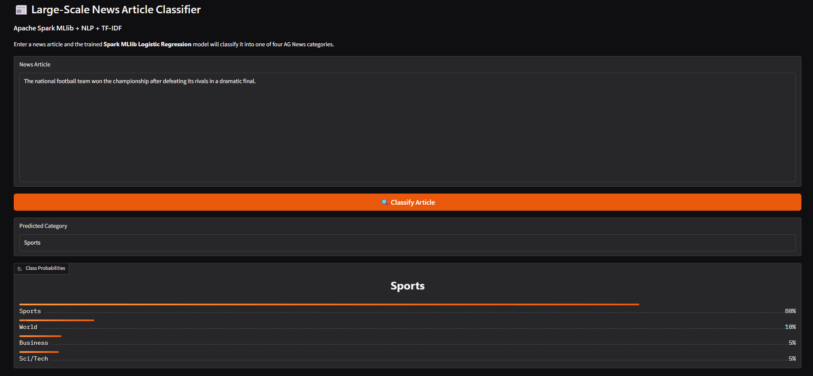
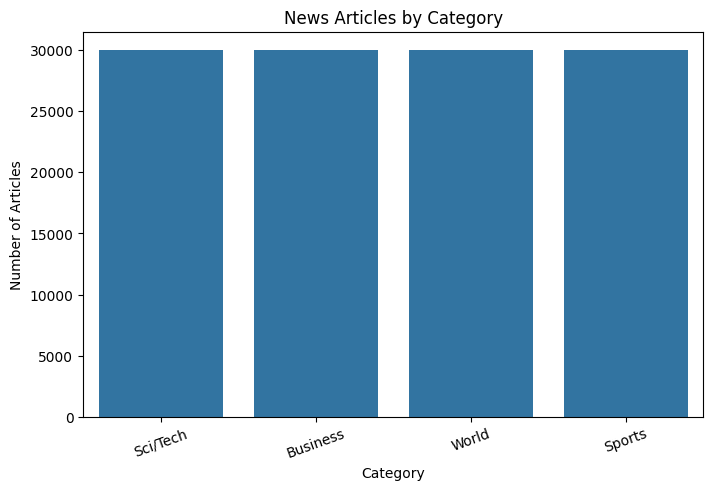
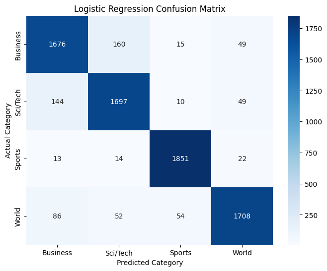
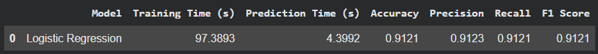

# Large-Scale News Article Classification Using Apache Spark MLlib

## Project Overview

This project implements a large-scale news article classification system using Apache Spark MLlib and Natural Language Processing (NLP).

The system classifies news articles into four categories:

- World
- Sports
- Business
- Sci/Tech

The project uses TF-IDF for text feature extraction and Logistic Regression from Spark MLlib for classification.

A Gradio web interface is included for testing the trained model with new news articles.

## Technologies Used

- Python
- Apache Spark
- PySpark
- Spark MLlib
- Natural Language Processing (NLP)
- TF-IDF
- Logistic Regression
- Pandas
- Matplotlib
- Seaborn
- Gradio
- Google Colab

## Dataset

This project uses the **AG News Topic Classification Dataset**.

The AG News topic classification dataset contains 120,000 training samples and 7,600 test samples across four categories: World, Sports, Business, and Sci/Tech. The dataset is constructed by selecting four classes from the original AG corpus.

### Dataset Source

The CSV files used by this project are downloaded from:

**AG News CSV Repository:**  
https://github.com/mhjabreel/CharCnn_Keras/tree/master/data/ag_news_csv

The direct CSV URLs used by the notebook are:

- https://raw.githubusercontent.com/mhjabreel/CharCnn_Keras/master/data/ag_news_csv/train.csv
- https://raw.githubusercontent.com/mhjabreel/CharCnn_Keras/master/data/ag_news_csv/test.csv

The same CSV URLs and split sizes are documented by TorchText's AG News dataset loader.

The notebook automatically downloads the required `train.csv` and `test.csv` files when executed, so the dataset files are not redistributed in this repository.

### Dataset Credit and Original Research

The AG News topic classification benchmark was constructed by **Xiang Zhang** from the AG corpus and used in the following research paper:

> Zhang, X., Zhao, J., & LeCun, Y. (2015). Character-level Convolutional Networks for Text Classification. Advances in Neural Information Processing Systems 28 (NIPS 2015).

Paper: https://arxiv.org/abs/1509.01626

The dataset documentation attributes the benchmark to Zhang, Zhao, and LeCun and identifies the original AG corpus as a collection of more than one million news articles gathered from more than 2,000 sources.

## Methodology

```text
AG News Dataset
       ↓
Spark DataFrame
       ↓
Data Cleaning
       ↓
Text Tokenization
       ↓
Stop-word Removal
       ↓
TF-IDF Feature Extraction
       ↓
Spark MLlib Logistic Regression
       ↓
Prediction
       ↓
Evaluation
       ↓
Gradio Web Interface
```

## NLP Preprocessing

The text is processed using Spark-based NLP components:

1. Lowercasing
2. URL removal
3. HTML tag removal
4. Special-character removal
5. Whitespace normalization
6. Tokenization
7. Stop-word removal
8. TF-IDF feature extraction

## Machine Learning Model

### Logistic Regression

The project uses Logistic Regression from Apache Spark MLlib.

The model learns patterns in TF-IDF features and classifies each article into one of the four news categories.

## Evaluation Metrics

The model is evaluated using:

- Accuracy
- Weighted Precision
- Weighted Recall
- F1 Score
- Confusion Matrix

The notebook calculates these metrics from the actual test-set predictions.

## Web Interface

A Gradio interface is included in the notebook.

Users can:

1. Enter a news article.
2. Click **Classify Article**.
3. View the predicted category.
4. View the probability of each category.

### Interface



## Project Screenshots

### Dataset Distribution



### Confusion Matrix



### Model Performance



## How to Run

### Google Colab

1. Open the `.ipynb` notebook in Google Colab.
2. Run the cells from top to bottom.
3. The notebook automatically downloads the AG News dataset.
4. Spark preprocesses the data and trains the Logistic Regression model.
5. The notebook evaluates the model on the test set.
6. Run the Gradio cell.
7. Open the generated Gradio URL to test new articles.

## Installation

Install the required packages with:

```bash
pip install -r requirements.txt
```

## Project Structure

```text
Large-Scale-News-Article-Classification/
│
├── Large_Scale_News_Article_Classification_Gradio.ipynb
├── README.md
├── requirements.txt
├── .gitignore
│
└── screenshots/
    ├── dataset_distribution.png
    ├── confusion_matrix.png
    ├── performance_results.png
    └── gradio_ui.png
```

## Future Scope

Possible improvements include:

- Larger news datasets
- Real-time news classification
- Streaming news classification using Spark Streaming
- Multilingual news classification
- Advanced NLP models
- Distributed multi-node Spark deployment
- Production web deployment

## References

1. Zhang, X., Zhao, J., & LeCun, Y. (2015). *Character-level Convolutional Networks for Text Classification*. NIPS 2015.  
   https://arxiv.org/abs/1509.01626

2. AG News CSV Repository:  
   https://github.com/mhjabreel/CharCnn_Keras/tree/master/data/ag_news_csv

3. Apache Spark MLlib Documentation:  
   https://spark.apache.org/mllib/

4. Gradio Documentation:  
   https://www.gradio.app/
